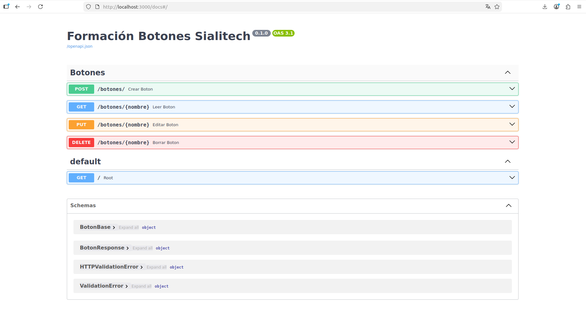

# 🔘 API de Botones Táctiles (Nivel Intermedio)

Esta API, desarrollada con **FastAPI**, permite gestionar botones táctiles para una aplicación. Los botones se almacenan de forma temporal en memoria y permiten realizar operaciones CRUD completas, además de gestionar su estado (encendido/apagado).

El proyecto ha sido **dockerizado** para asegurar un despliegue rápido y consistente en cualquier entorno.

---

## 🚀 Características del Proyecto
- **Tecnologías:** Python 3.10, FastAPI, Pydantic, Docker, Docker Compose.
- **Persistencia:** Temporal (Lista en memoria).
- **Puerto de servicio:** `3000` (mapeado al puerto interno 80 del contenedor).

## 🛠️ Requisitos previos
- [Docker](https://docs.docker.com/get-docker/) y [Docker Compose](https://docs.docker.com/compose/install/).

---

## 📦 Instalación y Despliegue con Docker

Para levantar la aplicación en un contenedor aislado, sigue estos pasos:

1. Navega hasta la carpeta del proyecto:
   ```bash
   cd api-botones
2. sudo docker compose up --build
3. La API estará disponible en tu navegador en: http://localhost:3000/docs

ENDPOINTS: 
[CRUD][https://learnsql.es/blog/que-es-el-crud/]

Ejemplo de creación (POST):
JSON

{
  "nombre": "Boton_Luz",
  "color": "#FFCC00"
}

🛑 Detener el servicio

Para detener el contenedor y limpiar los recursos creados:

sudo docker compose down




